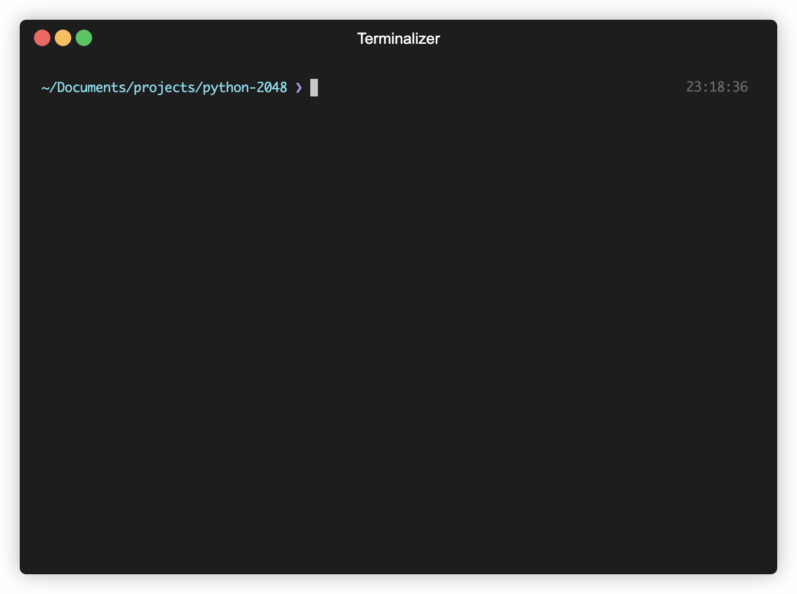

# python-2048


<p align="center">
  
</p>
<p align="center"><em>A terminal-based version of <a href="https://play2048.co/">2048</a> made in python.</em></p>

## Prequisites and Setup

Currently it only works for terminals which have support for 256 colors and unicode characters. The terminal used during development is `iterm2`.

Requires the `asciimatics` and `numpy` packages. The versions used during development are declared in `requirements.txt`.
Install them by running the command below in the project directory:

```
pip3 install -r requirements.txt
```

The python version used during development is 3.9.7


Start the game with `python3 main.py`. I recommend zooming in quite a bit before starting. 


## Remaining work

- Update the folder structure.
- Update the screenshot (we got highscores now woo).